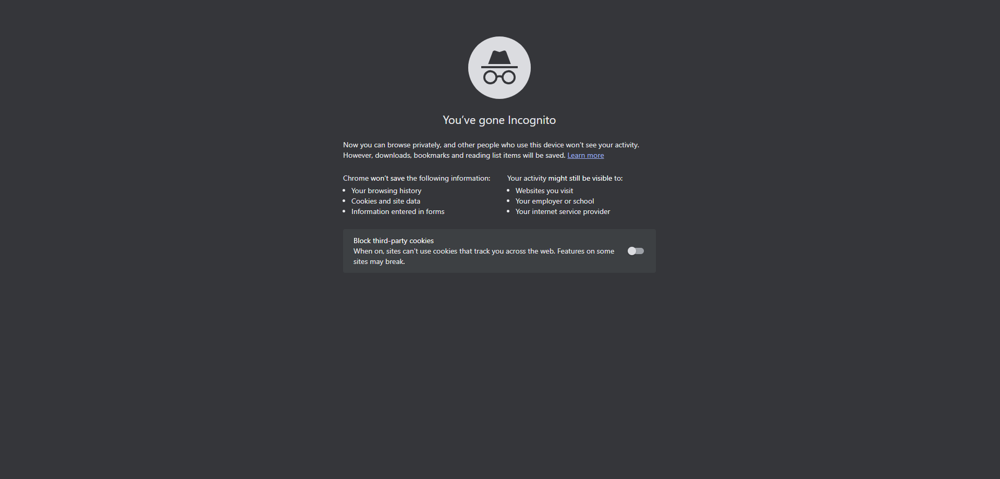

### JS Level One Introduction
In this section I will begin to build my understanding of adding interactive functionality to my websites !

Javascript support is built directly into modern web browsers. We can run Javascript directly into the browser console, or as a  full .js script connected to an HTML file.

Javascript is a full programming language, meaning unlike HTML or CSS it supports things such as arrays, loops and general logic.

Some basic programming concepts will be covered here :)

### Basics of Javascript
To start with the basics we open up our browser (mostly chrome or fire fox) it's better to open in incognito mode
to avoid gmail verification for chrome.
<p align="center"></p>

Right click the page and press inspect, then in the inspect then click on console. This is where we write the javascript code.

<p align="center" >
    
</p>


```

```
