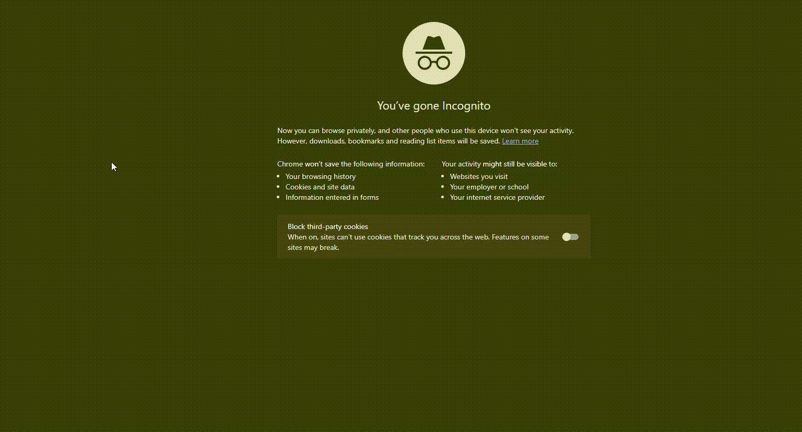

### JS Level One Introduction
In this section I will begin to build my understanding of adding interactive functionality to my websites !

Javascript support is built directly into modern web browsers. We can run Javascript directly into the browser console, or as a  full .js script connected to an HTML file.

Javascript is a full programming language, meaning unlike HTML or CSS it supports things such as arrays, loops and general logic.

Some basic programming concepts will be covered here :)

### Basics of Javascript
To start with the basics we open up our browser (mostly chrome or fire fox) it's better to open in incognito mode
to avoid gmail verification for chrome.
<p align="center"></p>

Right-click the page and press inspect, then in the inspect then click on console. This is where we write the javascript code.

<p align="center" >
    
</p>
After the console is selected, this is the place where we can write the javascript code
the console interprets it and executes it.

#### The Hello World of Javascript
```commandline
alert("Hello World!")
```
The output will be as follows:
<p align="center"></p>

### Comments in Javascript
``// anything here is a comment``

### Basic Data Types

- The first Basic data type is numbers, numbers can be integers (whole numbers)
    
    floating point numbers like 20.2 (has a decimal) and negative numbers
    
    Javascript unlike some other programming languages treats these all the same as numbers
    regardless.
- Strings are words wrapped in quotes eg "Hello World" and even digits eg "10" is a string
- Booleans are logical values that stand for true  and false
- Undefined and null (they are not the same thing)


### Integers
Javascript can act as a basic calculator as it can perform all the basic arithmetics such as
division, multiplication, addition and subtraction.

It can also perform exponential operation (2 ** 4) and the modulo operation, that is it returns
the remainder of a division 15 % 14 returns 1.

### Strings
They are sequences of characters, we can do a bunch of cool stuffs with strings, like concatenation
which is done with the "+" character.

Obtaining the length of a string is string.length
special escape character "\n" starts a new line and "\t" inserts a tab (4 spaces)

indexing a string starts at zero eg "hello"[0] returns "h"

### Variables 
The general form of variables in Javascript is of the form
```commandline
var varName = value; (The semicolon is not necessary)
```
Javascript uses camel case as the naming convention.
``eg var bankAccount = 100;``
So I have a variable called bankAccount which has a value of 100.

Some common Javascript functions
- alert()
- console.log()
- prompt()

### Control Flow
When dealing with control flow, we are going to initiate some condition check that returns a boolean,
either True or False
Based off those results we use control flow to execute a specific block of code.

```commandline
IF statement
if (condition){
    //Execute some code
}

IF ELSE statement
if (condition){
    //Execute some code
}else{
    //Execute some other code
}

IF, ELSE IF, ELSE statement
if (condition one){
    //Execute some code
}else if (condition two){
    //Execute some other code
}else{
    //Execute some backup code
}
```

```commandline
While Loop
while (condition){
    // Execute some code while
    // this condition is true
}
```

### For Loops
For loops allow you to continually execute code a specific number of times.

Javascript has three types of For Loops:

- For - loops through a number of times
- For/In - loops through a JS object
- For/of - used with arrays

```commandline
For Loop

for (statement1; statement2; statement3){
    // Execute some code
}

Example
for (var i = 0; i<5; i++){
    // Execute some code
}
```

